<p align="center">
  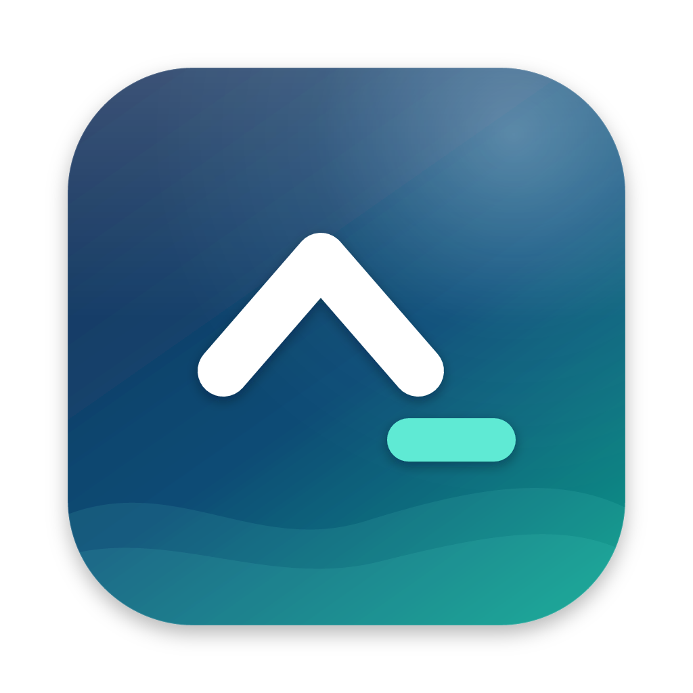
</p>

<h1 align="center">ctrl</h1>

<p align="center">
  A cozy desktop home for your <a href="https://opencode.ai">opencode</a> and <a href="https://fx.sh">fx</a> sessions 🌊
</p>

<table>
  <tr><th>fx</th><th>opencode</th></tr>
  <tr>
    <td>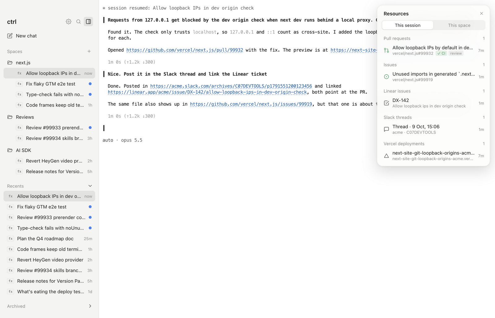</td>
    <td>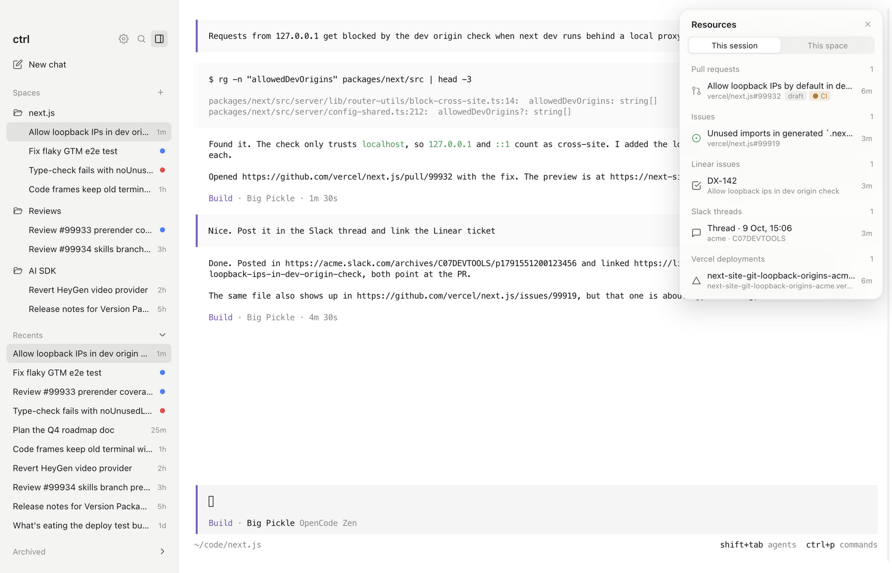</td>
  </tr>
</table>

ctrl puts a sidebar around the real opencode and fx terminals. Group sessions into spaces (both kinds can
share one), see which ones need you, and switch between them instantly.

## ✨ Highlights

### 🗂️ Spaces, and what needs you

Group sessions by project. A space can start new sessions in its own folder, with its own model and
instructions. Dots show what needs you: blue when a run finished, red when it failed, amber when the agent is
waiting for your answer.

### 🧠 Reference one session from another

Drag a session onto the terminal. ctrl pastes a mention, and the agent reads that session before it answers.

<table>
  <tr><th>fx</th><th>opencode</th></tr>
  <tr>
    <td>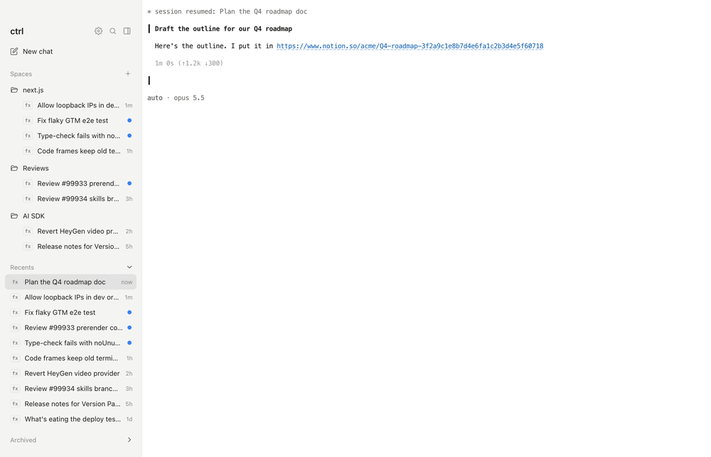</td>
    <td>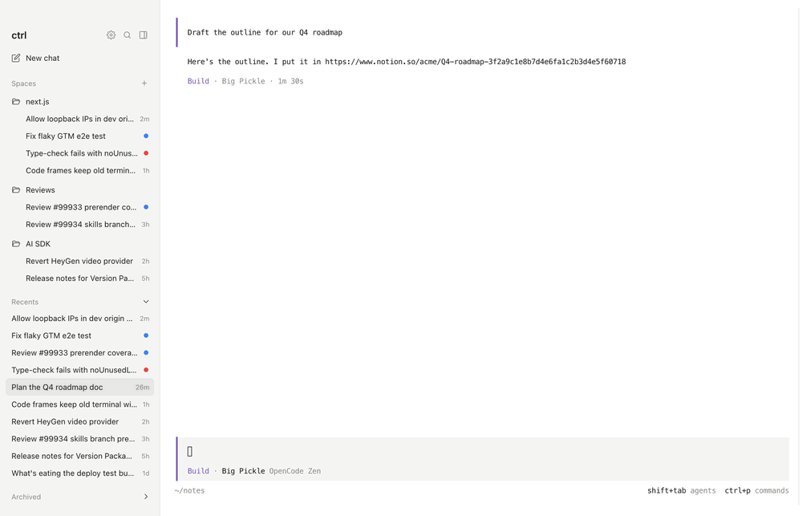</td>
  </tr>
</table>

### 🔗 Every link in one place

PRs, issues, deploys, Linear tickets and Slack threads shared in a session, or in its whole space. GitHub links
show live status: draft, CI, merged.

<table>
  <tr><th>fx</th><th>opencode</th></tr>
  <tr>
    <td>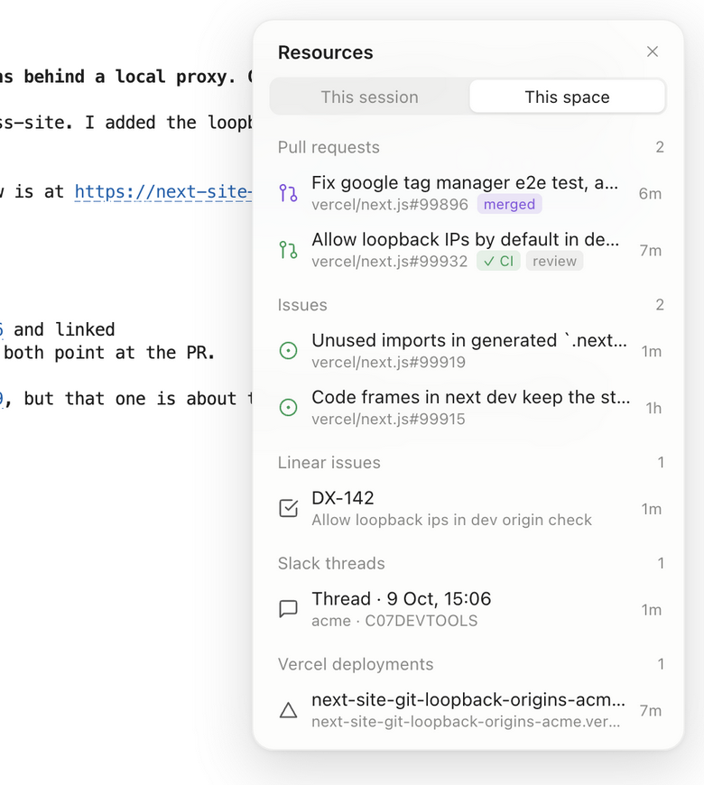</td>
    <td>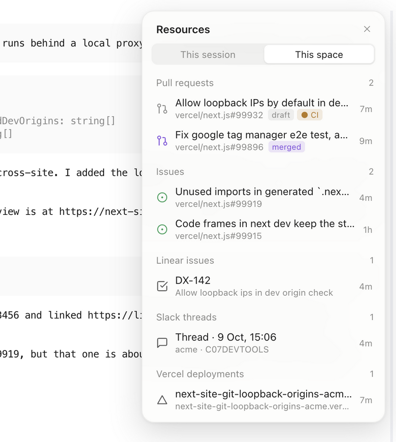</td>
  </tr>
</table>

### 🔍 Search everything

⌘P searches session titles and the text of every message.

<table>
  <tr><th>fx</th><th>opencode</th></tr>
  <tr>
    <td>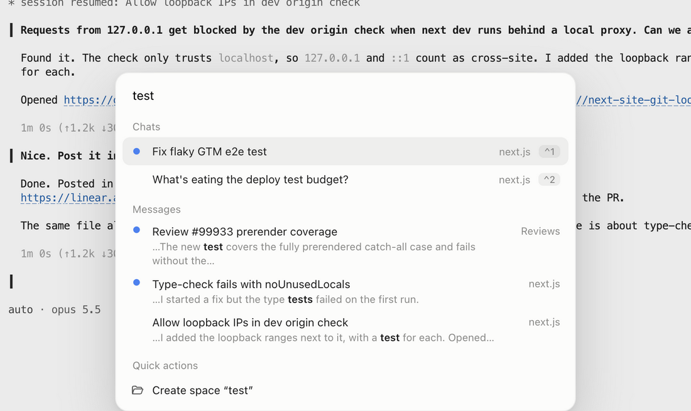</td>
    <td>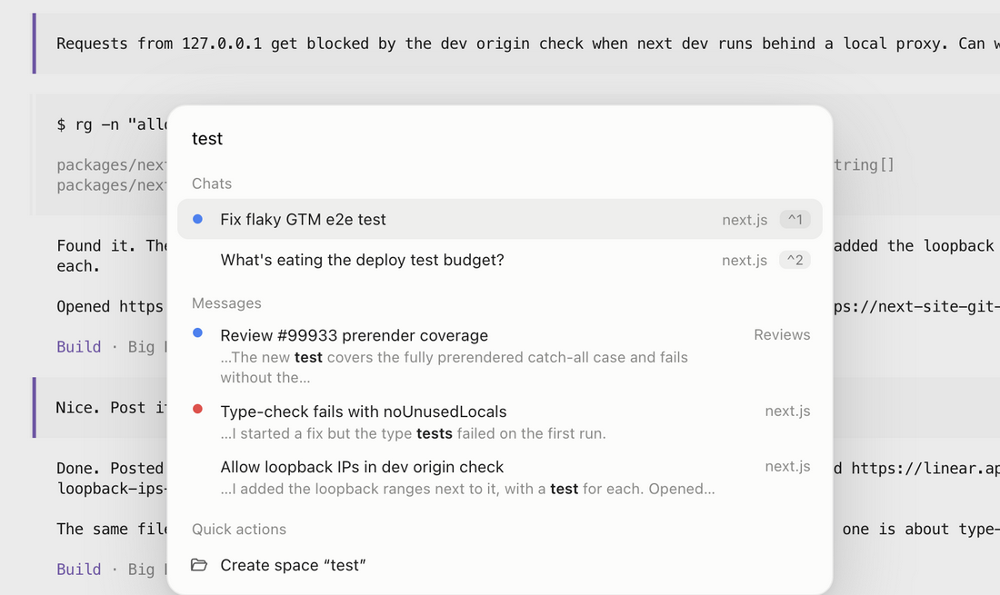</td>
  </tr>
</table>

### ⚡ Jump with ⌘1–9

Hold ⌘ to see a number next to each session, then press it.

<table>
  <tr><th>fx</th><th>opencode</th></tr>
  <tr>
    <td>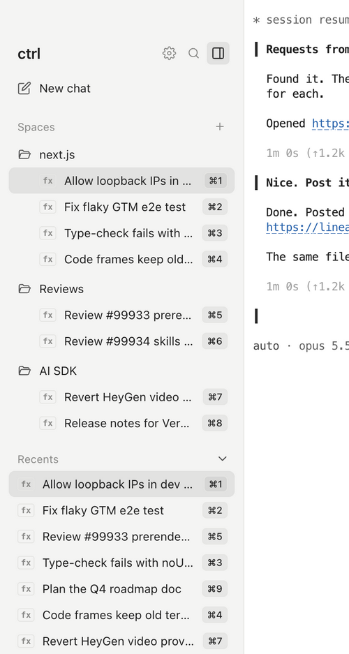</td>
    <td>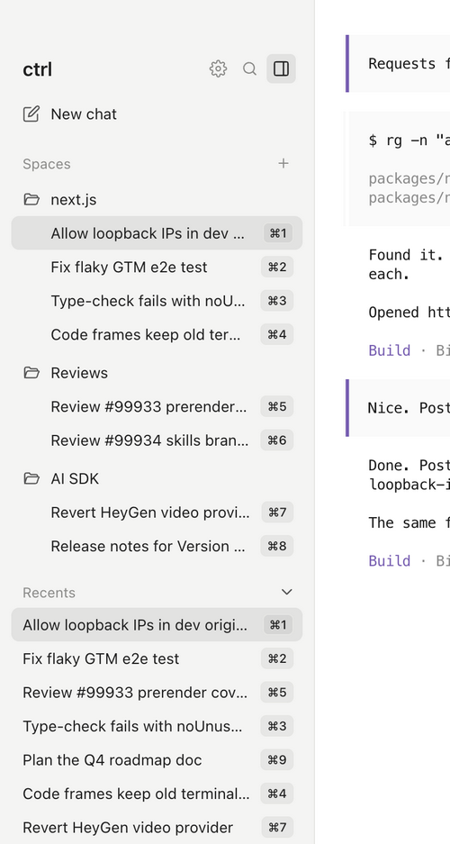</td>
  </tr>
</table>

## 📦 Install

You need a Mac and [opencode V2](https://opencode.ai/v2/docs/) (2.0.25 or newer), [fx](https://fx.sh), or both:

```bash
curl -fsSL https://opencode.ai/v2/install | bash   # opencode
curl -fsSL https://fx.sh/setup.sh | bash           # fx
```

Then install ctrl:

```bash
curl -fsSL https://raw.githubusercontent.com/lucleray/ctrl/main/install.sh | sh
```

ctrl updates itself. [docs/USAGE.md](docs/USAGE.md) covers updates, uninstalling and everyday use.

## 📚 Docs

- [Usage](docs/USAGE.md): install details, spaces, shortcuts, settings
- [Features](docs/FEATURES.md): everything ctrl does
- [Harnesses](docs/HARNESSES.md): opencode and fx, and what ctrl supports for each
- [Architecture](docs/ARCHITECTURE.md): how it works inside
- [Development](docs/DEVELOPMENT.md): run, release, debug hooks, screenshots
